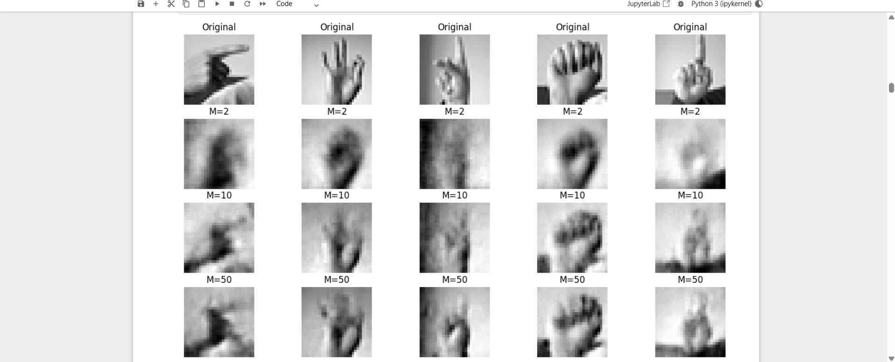
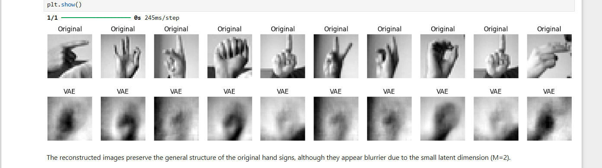
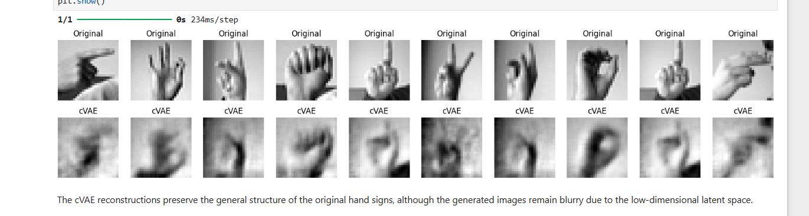
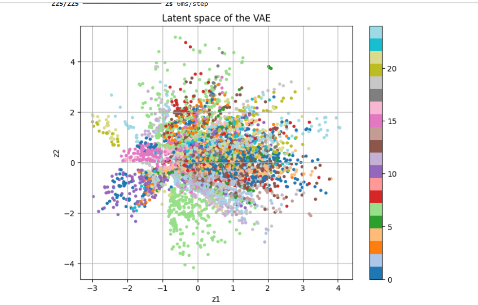
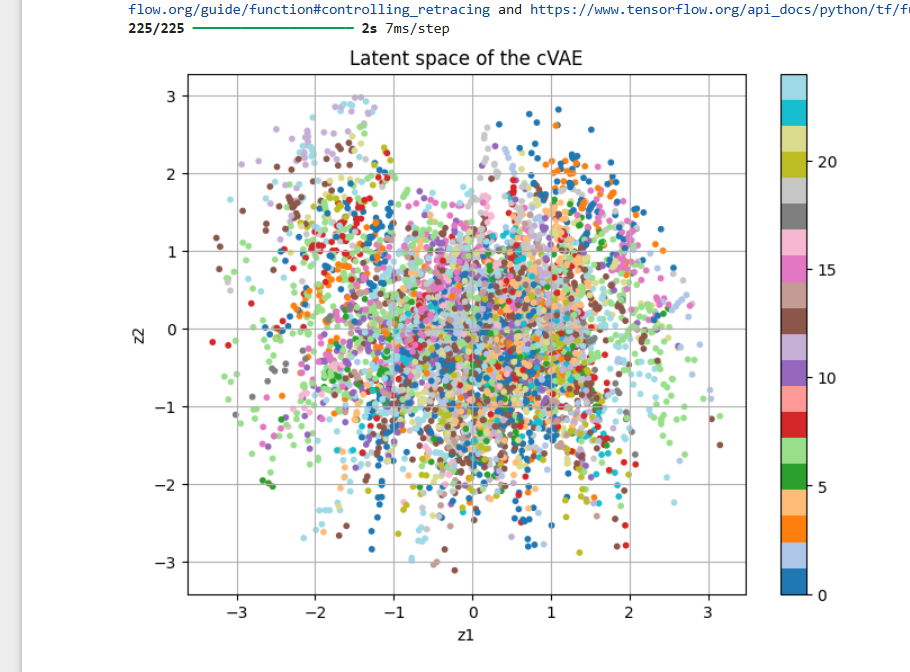
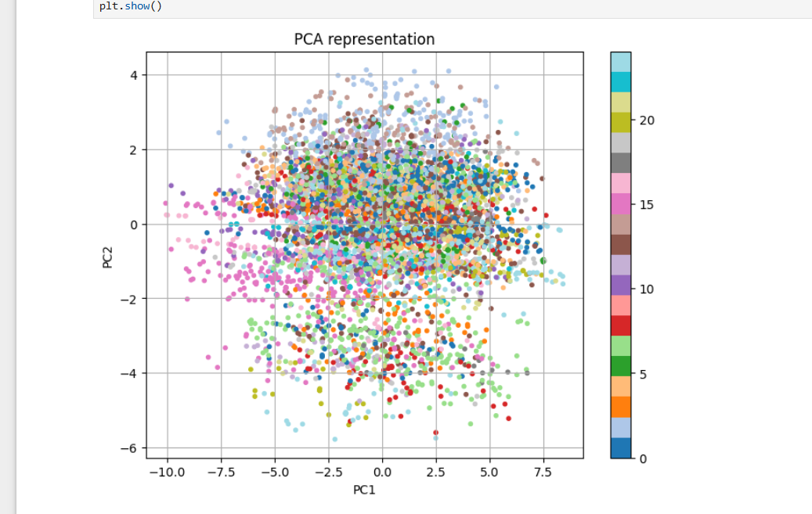
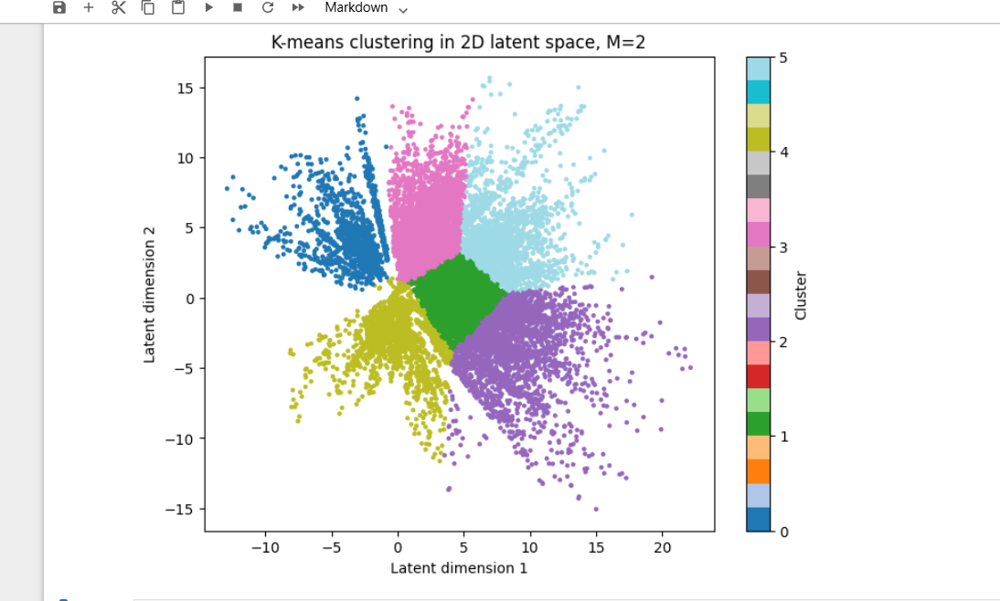

# Sign Language Representation Learning

This project explores representation learning techniques on the Sign Language MNIST dataset using deep learning methods.

The main goal was to study how different models learn compact latent representations of image data and how these representations can be used for:

* image reconstruction
* clustering
* classification
* generative image modeling

The project includes experiments with:

* Convolutional Autoencoders (AE)
* Variational Autoencoders (VAE)
* Conditional Variational Autoencoders (cVAE)
* Principal Component Analysis (PCA)

---

# Dataset

This project uses the Sign Language MNIST dataset available on Kaggle:

[Sign Language MNIST Dataset](https://www.kaggle.com/datasets/datamunge/sign-language-mnist)

The dataset contains grayscale images of American Sign Language hand gestures for 24 different classes.

Dataset files used:

* `sign_mnist_train.csv`
* `sign_mnist_test.csv`

---

# Example Results

## Autoencoder Reconstructions

Comparison of reconstruction quality for different latent dimensions (`M=2`, `M=10`, `M=50`).

The results show that larger latent dimensions preserve significantly more visual information and improve reconstruction quality.



---

## VAE Reconstructions

Reconstructed images generated by the Variational Autoencoder using a low-dimensional latent space (`M=2`).

Although the reconstructions appear blurrier than the standard autoencoder outputs, the VAE learns smoother and more continuous latent representations.



---

## cVAE Reconstructions

Reconstructed images generated by the Conditional Variational Autoencoder.

The cVAE preserves the general structure of the original hand signs while enabling label-conditioned image generation.



---

## VAE Latent Space

Visualization of the latent space learned by the Variational Autoencoder (VAE).

The latent representations form smoother distributions compared to the standard autoencoder.



---

## cVAE Latent Space

Visualization of the latent space learned by the Conditional Variational Autoencoder.

The class-conditioned structure produces more organized latent representations while maintaining smooth transitions between samples.



---

## PCA Representation

Two-dimensional PCA projection used as a linear baseline for comparison with deep latent representations.

Compared to the learned latent spaces, PCA exhibits significantly stronger overlap between classes.



---

## K-Means Clustering in Latent Space

K-Means clustering applied on the two-dimensional latent representations learned by the autoencoder.

The clustering results indicate that meaningful structure exists inside the learned latent space representations.



---

# What I Implemented

## 1. Data Preprocessing

Before training the models, I:

* normalized pixel values to the range `[0,1]`
* reshaped the images to `(28, 28, 1)` for convolutional layers
* visualized sample images after preprocessing

---

## 2. Convolutional Autoencoders

I implemented convolutional autoencoders with different latent dimensions:

* `M = 2`
* `M = 10`
* `M = 50`

The encoder consists of:

* convolutional layers
* max pooling layers
* dense layers

The decoder reconstructs the images using:

* dense layers
* transposed convolutions

The experiments examined how the latent dimension affects:

* reconstruction quality
* latent representations
* downstream classification performance

---

## 3. Variational Autoencoder (VAE)

I implemented a Variational Autoencoder using:

* Gaussian latent variables
* the reparameterization trick
* a custom training loop with `tf.GradientTape`

The VAE loss combines:

* reconstruction loss
* KL divergence loss

I also visualized:

* reconstructed images
* generated samples from random latent vectors
* the learned latent space

---

## 4. Conditional Variational Autoencoder (cVAE)

I extended the VAE into a Conditional VAE by providing class labels to:

* the encoder
* the decoder

The cVAE can generate images conditioned on a selected sign language class.

One-hot encoded labels were used during training and image generation.

---

## 5. Classification Experiments

To evaluate the learned representations, I trained SVM classifiers using:

* latent vectors from Autoencoders
* latent vectors from the VAE
* latent vectors from the cVAE
* PCA representations

The following metrics were evaluated:

* Accuracy
* Precision
* Recall
* F1-score

---

## 6. Clustering Experiments

I applied:

* K-Means clustering
on the latent representations learned by the autoencoders.

The experiments also included:

* silhouette score evaluation
* search for optimal cluster numbers

---

# Key Observations

Some of the main observations from the experiments were:

* Larger latent dimensions produced clearer image reconstructions and improved classification performance.
* The Autoencoder with `M=50` achieved the best downstream classification results.
* PCA showed substantially stronger overlap between classes because it relies on linear projections.
* The VAE learned smoother latent representations and generated new hand sign images from Gaussian noise.
* The cVAE enabled label-conditioned image generation using class information.
* The clustering experiments demonstrated that meaningful structure exists inside the learned latent spaces.

---

# Technologies Used

* Python
* TensorFlow / Keras
* NumPy
* Pandas
* Matplotlib
* Scikit-learn
* SciPy

---

# Project Structure

```text
sign-language-representation-learning/
│
├── data/              # Dataset folder (not uploaded to GitHub)
├── notebooks/         # Jupyter notebooks
├── outputs/           # Saved plots and visualizations
├── README.md
├── requirements.txt
└── .gitignore